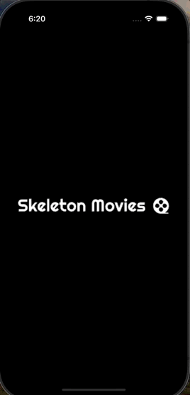

# SkeletonMoviesSwiftUI
SwiftUI Clean Code Architecture

## Project Description

- SwiftUI Clean Code Architecture.
- Routing Navigation.
- Package management through SPM.
- Dependency injection.
- Async/Await.
- Localized texts to facilitate the addition of new languages.
- Custom Console Log for easy debugging.
- Unit test.

## Features 

- Onboarding slides with Lottie animations (only during the first launch of the app).
- Paginated query to a public API.
- Search bar that allows the user to search for movies by title.
- Pull to refresh
- Error handling (Ex: No Internet connection or empty states)

## Preview 

